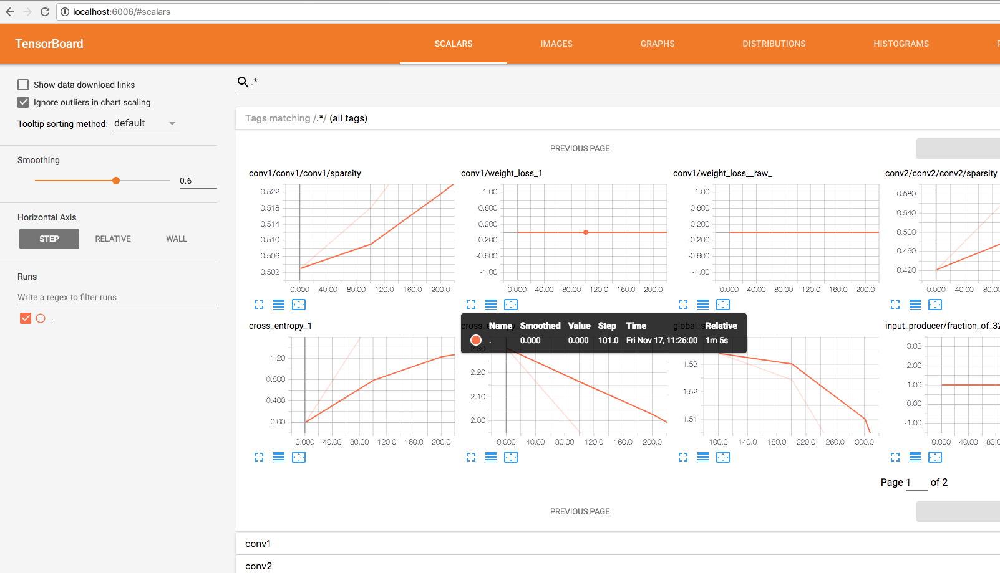

## Main Tools

1. Create a directory called `workspace_tf` somewhere.
1. Install [Sourcetree](https://www.sourcetreeapp.com/) (optional)
1. Install Homebrew
1. Clone this repo (`cd ~/path_to/workspace_tf`, `git clone https://github.com/Knowm/HelloTensorFlow.git`)
1. `brew cask install java`
1. `brew install python3`
1. `brew cask install eclipse-cpp` or `brew cask reinstall eclipse-cpp`

## PyDev in Eclipse

1. Create a workspace pointing to `workspace_tf`.
1. Install PyDev in Eclipse. `Help ==> Install new Software`... Click on `Add…` then `PyDev` in `Name` and `http://pydev.org/updates/` in `Location`. Select `PyDev` and click through the wizard. 
1. Configure PyDev in Eclipse preferences to point to installed Python executable. Go to `Eclipse ==> Preferences ==> PyDev ==> Interpreter - Python` Select `New`, set `python3` and `/usr/local/bin/python3`

## Import Python Project into Eclipse (PyDev)

1. Right click ==> New... ==> Project...
1. PyDev ==> PyDev Project ==> Next
1. Uncheck 'Use Default'
1. Browse to project Directory
1. Copypasta Project Name
1. Next

### Test Python in Eclipse

1. Right-click `src/hellopy.py` ==> Run As ==> Python Run

```
if __name__ == '__main__':
    print('Hello World')
```

```
Hello World
```

## Tensorflow
```
    pip3 install --upgrade tensorflow
```

### Test TensorFlow in Eclipse

1. Right-click `src/hellotf.py` ==> Run As ==> Python Run

```
# https://mubaris.com/2017-10-21/tensorflow-101

# Import TensorFlow
import tensorflow as tf

# Define Constant
output = tf.constant("Hello, World")

# To print the value of constant you need to start a session.
sess = tf.Session()

# Print
print(sess.run(output))

# Close the session
sess.close()
```

```
2017-11-17 10:33:55.587159: W tensorflow/core/platform/cpu_feature_guard.cc:45] The TensorFlow library wasn't compiled to use SSE4.2 instructions, but these are available on your machine and could speed up CPU computations.
2017-11-17 10:33:55.587179: W tensorflow/core/platform/cpu_feature_guard.cc:45] The TensorFlow library wasn't compiled to use AVX instructions, but these are available on your machine and could speed up CPU computations.
2017-11-17 10:33:55.587188: W tensorflow/core/platform/cpu_feature_guard.cc:45] The TensorFlow library wasn't compiled to use AVX2 instructions, but these are available on your machine and could speed up CPU computations.
2017-11-17 10:33:55.587192: W tensorflow/core/platform/cpu_feature_guard.cc:45] The TensorFlow library wasn't compiled to use FMA instructions, but these are available on your machine and could speed up CPU computations.
b'Hello, World'
```

## Some Possible Issues

1. `AttributeError: module 'enum' has no attribute 'IntFlag'` ==> run ` pip3 uninstall enum34`
1. `RuntimeWarning: compiletime version 3.5 of module 'tensorflow.python.framework.fast_tensor_util' does not match runtime version 3.6` ==> Just igmore the warning
1. `Your CPU supports instructions that this TensorFlow binary was not compiled to use: SSE4.1 SSE4.2 AVX AVX2 FMA` ==> You need to compile TF yourself with the appropriate flags to leverage advanced CPU instructions. Just ignore.

## MNIST from `Tensorflow/models`

```
cd ~/path_to/workspace_tf
git clone https://github.com/tensorflow/models.git
python3 models/tutorials/image/mnist/convolutional.py
```

Alternatively, import the models project into Eclipse as described above for HelloTensorFlow, right-click `tutorials/image/mnist/convolutional.py` ==> Run As ==> Python Run.

## Cifar-10 from `Tensorflow/models`

```
cd ~/path_to/workspace_tf
python3 models/tutorials/image/cifar10/cifar10_train.py
```
In a different console window:

```
tensorboard --logdir=/tmp/cifar10_train
```

Open [http://localhost:6006](http://localhost:6006) in browser to view tensorboard.



After training and monitoring on tensorboard:
 
```
python3 cifar10_eval.py
```

## Results on Mac (CPU only)

| Device | Info |
|---|---|
| CPU | Intel i5 2.9 GHz |
| RAM | Apple 8GB DDR3 1867 MHz 2 core |

Running 5000 steps on the CPU took 57 minutes.


