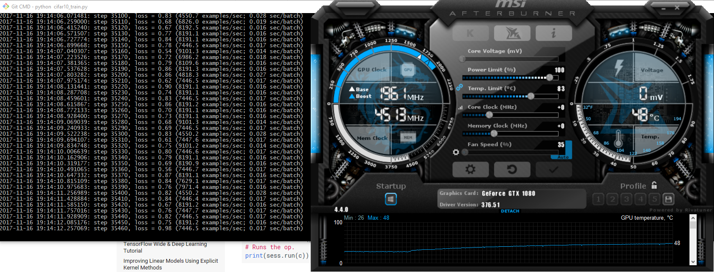
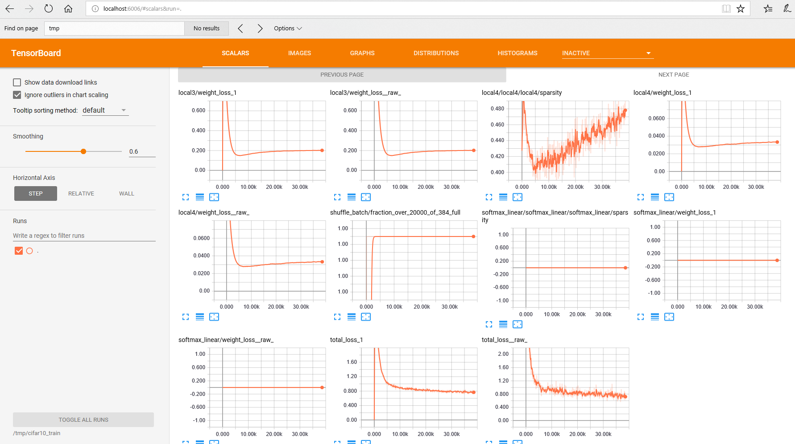

## Main Tools

1. Create a directory called `workspace_tf` somewhere.
1. Install [Sourcetree](https://www.sourcetreeapp.com/)
1. Clone this repo (`cd ~/path_to/workspace_tf`, `git clone https://github.com/Knowm/HelloTensorFlow.git`)
1. Install [Git-Gui](https://git-for-windows.github.io/) (for command line stuff)
1. Install [Java8](http://www.oracle.com/technetwork/java/javase/downloads/jdk8-downloads-2133151.html)
1. Install [Python](https://www.python.org/downloads/windows/)
1. Install [Eclipse](https://www.eclipse.org/cdt/downloads.php)

## Python

1. Create a workspace pointing to `workspace_tf`.
1. Install PyDev in Eclipse. `Help ==> Install new Software`... Click on `Add…` then `PyDev` in `Name` and `http://pydev.org/updates/` in `Location`. Select `PyDev` and click through the wizard. 
1. Configure PyDev in Eclipse preferences to point to installed Python executable. Go to `Window ==> Preferences ==> PyDev ==> Interpreter - Python` Select `Qucik auto-Config` and it should find `python` automatically.

## Import Python Project into Eclipse (PyDev)

1. Right click ==> New... ==> Project...
1. PyDev ==> PyDev Project ==> Next
1. Uncheck 'Use Default'
1. Browse to project Directory
1. Copypasta Project Name
1. Next

To get Python to run from the command line, open up the command promt (type `cmd`), then:

```
c:/Path/to/AppData/Local/Programs/Python/Python36/Tools/scripts/win_add2path.py
```
This adds all the correct paths to the $PATH.
	
### Test Python in Eclipse

1. Right-click `hellopy.py` ==> Run As ==> Python Run

```
if __name__ == '__main__':
    print('Hello World')
```

```
Hello World
```

## CUDA and CUDNN

* [CUDA installation guide](http://docs.nvidia.com/cuda/cuda-installation-guide-microsoft-windows/)
* Nvidia recommends installing [Visual Studio](https://www.visualstudio.com/free-developer-offers/) so why not? Will come in handy later if developing GPU code.

The official Tensorflow 1.4 builds require CUDA 8 and CuDNN 6, so don't install the latest and greatest.

1. Download and install [Cuda 8 Toolkit](https://developer.nvidia.com/cuda-toolkit-archive) (Do the base install and the patch afterwards)
1. Download [CuDNN 6 Toolkit](https://developer.nvidia.com/rdp/cudnn-download) (requires nvidia developer account)
1. Follow install [instructions] 1-3 (http://docs.nvidia.com/deeplearning/sdk/cudnn-install/index.html) (adapt for CUDA 8 and CuDNN 6) Follow additional instructions later for CuDNN dev, but not needed for TF.

## TensorFlow

1. Open up the command promt (type `cmd`)
1. `python -m pip install --upgrade pip`
1. `pip install --upgrade tensorflow-gpu`

### Test TensorFlow in Eclipse

1. Right-click `hellotf.py` ==> Run As ==> Python Run

```
# https://mubaris.com/2017-10-21/tensorflow-101

# Import TensorFlow
import tensorflow as tf

# Define Constant
output = tf.constant("Hello, World")

# To print the value of constant you need to start a session.
sess = tf.Session()

# Print
print(sess.run(output))

# Close the session
sess.close()
```

```
2017-11-17 08:56:23.787312: I C:\tf_jenkins\home\workspace\rel-win\M\windows-gpu\PY\36\tensorflow\core\platform\cpu_feature_guard.cc:137] Your CPU supports instructions that this TensorFlow binary was not compiled to use: AVX AVX2
2017-11-17 08:56:23.982426: I C:\tf_jenkins\home\workspace\rel-win\M\windows-gpu\PY\36\tensorflow\core\common_runtime\gpu\gpu_device.cc:1030] Found device 0 with properties: 
name: GeForce GTX 1080 major: 6 minor: 1 memoryClockRate(GHz): 1.8225
pciBusID: 0000:01:00.0
totalMemory: 8.00GiB freeMemory: 6.66GiB
2017-11-17 08:56:23.982655: I C:\tf_jenkins\home\workspace\rel-win\M\windows-gpu\PY\36\tensorflow\core\common_runtime\gpu\gpu_device.cc:1120] Creating TensorFlow device (/device:GPU:0) -> (device: 0, name: GeForce GTX 1080, pci bus id: 0000:01:00.0, compute capability: 6.1)
b'Hello, World'
```


## MNIST from `Tensorflow/models`

1. Open up the Git command prompt (not `cmd`!)

```
cd ~/path_to/workspace_tf
git clone https://github.com/tensorflow/models.git
python models/tutorials/image/mnist/convolutional.py
```

Alternatively, import the models project into Eclipse as described above for HelloTensorFlow, right-click `tutorials/image/mnist/convolutional.py` ==> Run As ==> Python Run.

### Force to run on CPU (disable GPU)

1. Open up `models/tutorials/image/mnist/convolutional.py`.
1. Add...

```
import os
os.environ["CUDA_VISIBLE_DEVICES"]="-1" # this disables the GPU and it will run on the CPU only, set to "0" for GPU
from tensorflow.python.client import device_lib
print(device_lib.list_local_devices())
```

### CPU vs GPU

Running on the CPU took 25 minutes, while running on the GPU took 14 minutes.

## Cifar-10

1. Open up the Git command prompt (not `cmd`!)

```
cd ~/path_to/workspace_tf
python models/tutorials/image/cifar10/cifar10_train.py
```

In a different console window:

```
tensorboard --logdir=/tmp/cifar10_train
```
Open the link it gives you in browser to view tensorboard.





After training and monitoring on tensorboard:

```
python models/tutorials/image/cifar10/cifar10_eval.py
```

## Results on Windows  CPU vs GPU

| Device | Info |
|---|---|
| CPU | Intel i7-7700K 4.20 GHz 8 core |
| GPU | NVidia 1080 8GB  |
| RAM | Apple 32GB DDR4 3200 MHz |

Running 5000 steps on the CPU took 28 minutes, while running on the GPU took a little over a minute for a 19.7x performance increase!


